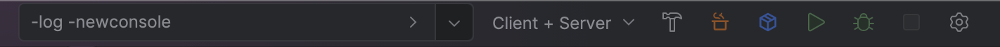
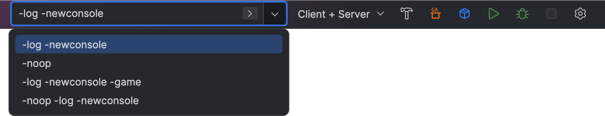
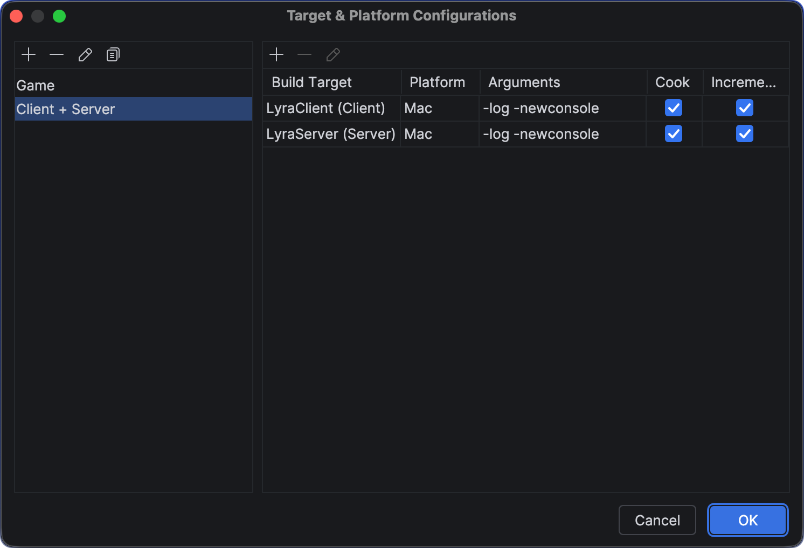

# Unreal Launcher (for Rider)

Rider plugin for Unreal projects. **Unreal Launcher** is a utility that provides:

- Easy access to commandline arguments for running/debugging your games
- Configurable, and shareable, configurations to quickly build, cook and launch multiple targets at once. For example: Client and Server builds, without having to change to active target in Rider directly.

_Why do I want this?_

If you've worked on multiplayer games, you'll know how tedious it can be to switch from Editor to Client/Server for testing, especially since Rider doesn't support launch and debugging both Client and Server in a single IDE session. With **Unreal Launcher**, you configure sets of targets, such as "Client + Server", or "2x Client + Server" and use the quick actions in the toolbar to Cook and Run.

Configurations are saved in `.unrealhelper/target-platforms.json` and can be committed with your project for the whole team to use.

## Installation

Download `UnrealLauncher-vX.Y.Z.zip` from the latest [GitHub Release](https://github.com/cmroche/UnrealHelper/releases). In Rider, open **Settings | Plugins**, choose **Install Plugin from Disk** from the gear menu, select the ZIP without extracting it, and restart Rider when prompted.

## Using Unreal Launcher

### Build, Cook, Package, Launch, or Debug

Select a configuration, then build, cook, package, launch, or debug every target directly from Rider's toolbar.

### Select a Configuration and Global Arguments

Choose a shared Target & Platform configuration and optionally add global arguments to every launched or debugged process.

### Create a Target & Platform Configuration

Choose **Configure ...** to create a shareable set of targets, platforms, arguments, and cooking options for your project.

## License

Unreal Launcher is licensed under the [Apache License 2.0](LICENSE). See [NOTICE](NOTICE) for attribution information.

## Contributing

### SemVer and Conventional Commit

Use `type(optional-scope): description` for the title. Release impact is:

- `feat:` creates a minor release.
- `fix:`, `perf:`, and `revert:` create a patch release.
- `build:`, `chore:`, `ci:`, `docs:`, `refactor:`, `style:`, and `test:` create no release.
- A title using `!`, or a body footer written exactly as `BREAKING CHANGE: description`, creates a major release. Titles using `!` must include that footer in the PR body.

PR checks validate the title and body and run the plugin tests and build. These checks are advisory until required branch-protection checks are available for this private repository, so confirm they pass before squash merging.

### Building

Run `gradlew build` from the plugin root directory to build the plugin. The plugin build runs these tests automatically.

### Testing

Run the plugin tests with `gradlew test` from the plugin root directory. The plugin build runs these tests automatically.

### Debugging

Run `gradlew runIde` from the plugin root directory to launch Rider with the plugin installed. The plugin build runs this automatically.

### AI Policy

Use of AI is permitted, but all generated code must be self-reviewed for understanding, correctness, and verbosity before submitting a pull request.
